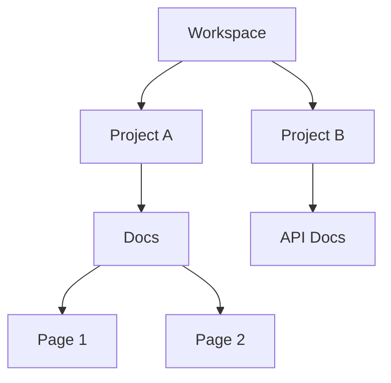

## Overview

Henry William organizes your project documentation into a flexible space hierarchy. You manage content through permissions, track changes with versioning, and integrate seamlessly with workflows. These concepts form the foundation for effective documentation.

<Columns cols={2}>
  <Card title="Space Hierarchy" icon="layers" href="#space-hierarchy">
    Nested spaces for projects and teams.
  </Card>
  <Card title="Permissions" icon="shield" href="#permissions">
    Role-based access control.
  </Card>
  <Card title="Versioning" icon="git-branch" href="#versioning">
    Full history and rollback.
  </Card>
  <Card title="Workflows" icon="git-pull-request" href="#workflows">
    Connect to your tools.
  </Card>
</Columns>

## Documentation Space Hierarchy

Spaces form a tree structure: root workspace > projects > docs > pages. You create nested spaces to mirror your organization.



This hierarchy supports permissions at each level. Child spaces inherit parent settings unless overridden.

<Callout kind="tip">
  Start with a root workspace for your entire organization to simplify management.
</Callout>

## User Permissions and Roles

Control access with four roles: Admin, Editor, Viewer, Guest. Assign roles per space.

<Tabs>
  <Tab title="Admin" icon="shield">
    Full control: manage users, spaces, and settings.
  </Tab>
  <Tab title="Editor" icon="edit-3">
    Create/edit pages, manage versions.
  </Tab>
  <Tab title="Viewer" icon="eye">
    Read-only access.
  </Tab>
  <Tab title="Guest" icon="user">
    Temporary read access with expiration.
  </Tab>
</Tabs>

| Role   | Manage Spaces | Edit Pages | View History |
|--------|---------------|------------|--------------|
| Admin  | Yes           | Yes        | Yes          |
| Editor | No            | Yes        | Yes          |
| Viewer | No            | No         | Yes          |
| Guest  | No            | No         | Limited      |

## Versioning and History Tracking

Every change creates a version. You view diffs, rollback, or compare branches.

<Steps>
  <Step title="Create Version" icon="save">
    Save changes to auto-commit.
  </Step>
  <Step title="View History" icon="clock">
    Click history icon on any page.
  </Step>
  <Step title="Rollback" icon="arrow-left">
    Select version and restore.
  </Step>
</Steps>

Use the API for programmatic access:

<CodeGroup tabs="JavaScript,Python">
  ```javascript
  const response = await fetch('https://api.example.com/v1/spaces/{spaceId}/history', {
    headers: { Authorization: `Bearer ${YOUR_TOKEN}` }
  });
  const versions = await response.json();
  console.log(versions);
  ```
  ```python
  import requests
  response = requests.get(
      'https://api.example.com/v1/spaces/{spaceId}/history',
      headers={'Authorization': f'Bearer {YOUR_TOKEN}'}
  )
  versions = response.json()
  print(versions)
  ```
</CodeGroup>

<ParamField path="spaceId" param-type="string" required="true">
  Unique space identifier.
</ParamField>

## Integration with Project Workflows

Connect Henry William to GitHub, Slack, or CI/CD pipelines. Webhooks notify on changes.

<Expandable title="Advanced Webhook Setup" default-open="false">

Configure webhooks via API:

```javascript
POST https://api.example.com/v1/webhooks
{
  "url": "https://your-webhook-url.com/webhook",
  "events": ["page.updated", "space.deleted"]
}
```

</Expandable>

<Callout kind="info">
  Test integrations in a staging space before production.
</Callout>

Master these concepts to build scalable documentation. Explore [quickstart](/quickstart) for hands-on setup.